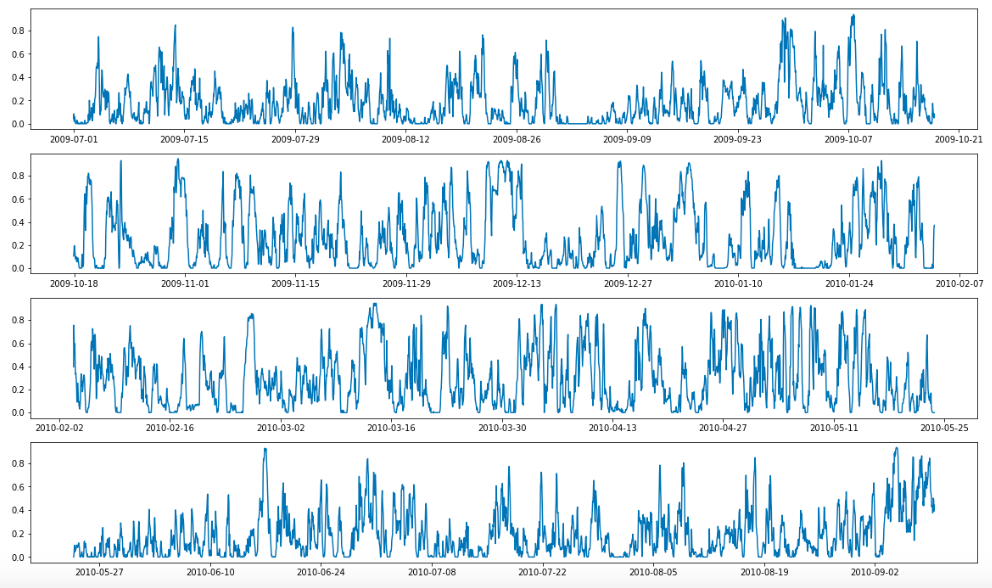
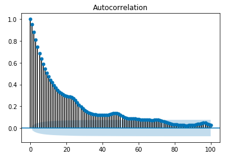
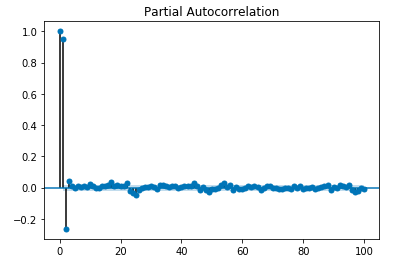
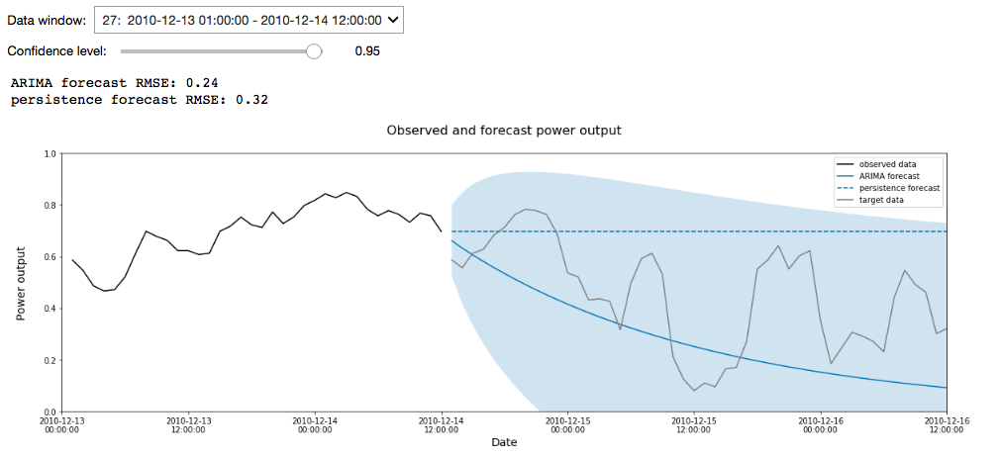
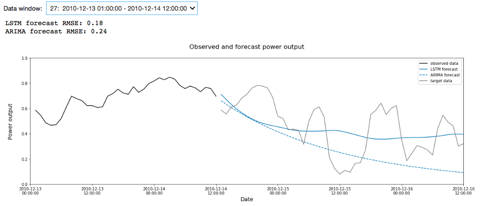

<h1 align="center">Forecasting a sustainable future</h1>
<h2 align="center">Predicting wind farm power output</h2>

  

## Outline

- [Project contents](#project-contents)
- [Problem statement](#problem-statement)
- [Data](#data)
- [Exploratory data analysis](#exploratory-data-analysis)
- [Modeling](#modeling)
- [Next steps](#next-steps)
- [Acknowledgments](#acknowledgments)

## Project contents

The structure of the repo for this project is very simple. The code is in the 'code' folder and all the csv files live in 'datasets'. That's all there is to it.

The python libraries used in this project are:
- pandas
- numpy
- datetime
- itertools
- time
- tqdm
- statsmodels
- sklearn
- keras
- tensorflow
- matplotlib
- ipywidgets

## Problem statement

Thankfully more and more of the energy we use is being generated from renewable sources such as solar and wind. However, these inherently produce variable output, due to their dependence on weather conditions. Grid operators need to carefully balance supply and demand, and so producing accurate forecasts for renewable power generation is important so as not to over or under-order power from other sources. Under-ordering could lead to blackouts whereas over-ordering can lead to fires from power surges as well as unnecessary CO2 emissions.

The overall goal of this project is to create accurate 48 hour forecasts for hourly power output across seven wind farms, based on previous power output data and current wind forecasts. Model performance is guided by the RMSE from true power output values.

The models have been built up in the following stages:

1. Univariate ARIMA model of power output at a single wind farm
2. Univariate LSTM model of power output at a single wind farm
3. LSTM model of power output at a single wind farm, with weather forecasts as an additional feature
4. A suite of LSTM models of power output across all seven wind farms

Due to time constraints, only the first two stages have been achieved so far.

## Data

This project is based on the <a href="https://www.kaggle.com/c/GEF2012-wind-forecasting#description">Global Energy Forecasting Competition 2012 - Wind Forecasting from Kaggle</a>, and uses the same datasets. The key dataset is 'train.csv', which contains the hourly (normalized) wind power measurements from all seven wind farms. In addition, there is a wind forecast dataset for each wind farm, which contains 48 hour ahead hourly forecasts for wind speed and direction, where forecasts are provided at 12 hour intervals. Finally, the file 'benchmark.csv' provides example forecast results from the persistence forecast method (i.e. the forecast is that the power output doesn't change) and also acts as a template for submission to kaggle.

## Exploratory data analysis

<a href="code/1_EDA.ipynb">EDA notebook</a>

#### Exploring the layout of the data

The power output data has been designed so that the period between 2009/7/1 and 2010/12/31 can be used for model identification and training, and the remainder of the data is the hold-out set for testing on kaggle. The hold-out set is designed to test 48 hour ahead predictions for hourly power output, and so has a repeating pattern of 36 hours of present data, followed by 48 hours of missing data.

The first step in EDA for this project was therefore to unpick and verify the layout of the data, making sure there were no unexpected gaps. At this stage, I also set up a validation test set that followed the same format as the hold-out set, and checked that the power output data was normalized correctly.

#### Exploring patterns in the data

Before creating a forecasting model, it is desirable to remove trends and seasonality in the data to create a stationary time series. This applies to both ARIMA models and to LSTMs. The time series plot for the first wind farm suggested that the power data didn't contain any trends or seasonality:

  

This was confirmed by running the Dickey-Fuller test, which produced a p-value of less than a trillionth of a percent. Therefore the null hypothesis that the time series contains a unit root (and therefore is non-stationary) was rejected.

## Modeling

#### Univariate ARIMA model

<a href="code/2.1_Model_univariate_time_series.ipynb">Univariate time series model notebook</a>

The first stage of modeling was to produce a univariate ARIMA model for power output at the first wind farm. To get an idea of what model parameters would be a good starting point, I plotted the ACF and PACF:

  

The plots showed a classic AR2 signature, where the PACF cuts off dramatically after 2 lags, and the ACF reduces steadily over time. This model produced an RMSE of 0.2726, which was a ~13% improvement on the baseline RMSE of 0.3145 from the persistent forecast method.

At this point I spent some time exploring other model parameters by writing a grid search style algorithm to select optimal parameters based on the lowest AIC/BIC and the lowest RMSE. After analyzing the results for these, however, I decided that the AR2 model had the best combination of accuracy and simplicity. See the notebook for more details.

To get an overall view of how the model was performing I made a widget that allows the user to look at a particular forecasting window and confidence level. Full functionality is only available via the notebook, but here is a snapshot:

  

#### Univariate LSTM model

<a href="code/2.2_Model_univariate_LSTM.ipynb">Univariate LSTM model notebook</a>

The next stage of modeling was to produce a univariate LSTM model for power output at the first wind farm. Starting with a very basic structure of a single LSTM layer, followed by a dense output layer, I was able to tune over the following hyper-parameters:

- Number of time steps input into the model for each prediction
- Number of hourly predictions output by the model in one steps
- Whether the LSTM is stateful or not (i.e. whether or not cell states are propagated to the next batch in the sequence)
- Number of neurons in the LSTM layer
- Number of training epochs

During the tuning process I learnt that:
- Models that use the full 36 hrs of available data as an input take a lot longer to run and don't perform much better than those that only use 2 hrs of data.
- Outputting a full 48 hr forecast in one step creates more accurate forecasts than predicting one hour at a time and looping through the forecasting.
- Models that are not stateful seem to perform very slightly better than those that are, but there is not a consistent trend.
- Increasing the number of neurons in the LSTM layer decreased the accuracy of the model.
- The LSTM model had the greatest predictive power at around 3-4 epochs, after which the model starting overfitting.

The model built from the optimal parameter set produced an RMSE of 0.2557, which was a ~19% improvement on the baseline RMSE.

To visualize the output from the model, I created another widget showing the predictions made over selected forecasting windows and how these compared with the target and ARIMA predictions. Again, full functionality is only available via the notebook, but here is a snapshot:

  

## Next steps

There is a lot more I'd like to achieve with this project. In particular:

- The ARIMA model I have used shows distinctly non-normal residuals after running model diagnostics. This means that the confidence intervals for the forecasts, which assume normally distributed residuals, are not accurate and should be be adjusted to allow for the higher kurtosis present in the data.

- In moving to an LSTM model, it becomes a lot more difficult to create confidence intervals around the power output forecasts, which is something I'd like to incorporate into my results. Initial research suggests that possible ways of doing this include using a model architecture that outputs a full forecast distribution, or using Monte Carlo simulation.

- Investigate how changing the batch size effects the performance of the LSTM model.

-  Extending the LSTM model to incorporate weather forecasts as a feature. I expect this to dramatically improve the performance of the model, as power output is proportional to the cube of the wind speed. Of course this relies on accurate forecasts of wind speed.

- Extending the project to a suite of models that predict power output across all seven wind farms, and submitting the predictions to Kaggle to check how my models compare with others.

## Acknowledgments

Thank you to the following people for all the support they gave me during this project and the DSI program:

- The teaching staff at <a href="https://generalassemb.ly">General Assembly</a> for getting me started on my data science journey. Special mentions go to Justin Pounders for all his fantastic advice on ARIMA models and LSTMs, and to Mark Popovich for his one-on-one coaching during the program.

- My classmates in the SF DSI Cohort at General Assembly for the  encouragement and technical feedback I've received during the DSI program, and for being fun colleagues to share a beer/boba with after class.

- Jason Brownlee of <a href="https://machinelearningmastery.com">Machine Learning Mastery</a> who through his amazingly instructive blog posts has unwittingly provided me with a wealth of technical information without which I wouldn't have been able to complete this project.

- My husband Dave for his constant, unwavering support in everything I do, but especially for making sure I've been fed and rested during the program, and for letting me bend his ear about cool new concepts I've learnt.
