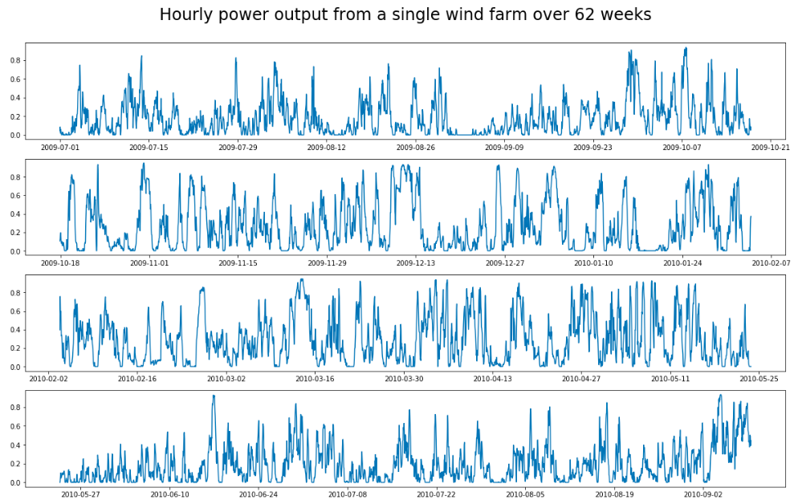

<h1 align="center">Forecasting a sustainable future</h1>
<h2 align="center">Predicting wind farm power output</h2>

  

## Outline

- [Project contents](#project-contents)
- [Problem statement](#problem-statement)
- [Data](#data)
- [Exploratory data analysis](#exploratory-data-analysis)
- [Modeling](#modeling)
- [Next steps](#next-steps)
- [Acknowledgments](#acknowledgments)

## Project contents

This project leverages times series analysis and machine learning techniques to predict power output from wind farms. The project walk-through may be of particular interest to those from a technical background, who haven't necessarily had prior experience with these models and are looking for a real world example of their effectiveness.

The structure of the repo for this project is simple. The code is in the 'code' folder and all the csv files live in 'datasets'. That's all there is to it.

The python libraries used in this project are:
- pandas
- numpy
- datetime
- itertools
- time
- tqdm
- statsmodels
- sklearn
- keras
- tensorflow
- matplotlib
- seaborn
- ipywidgets

## Problem statement

Thankfully more and more of the energy we use is being generated from renewable sources such as solar and wind. However, these inherently produce variable output, due to their dependence on weather conditions. Grid operators need to carefully balance supply and demand, and so producing accurate forecasts for renewable power generation is important so as not to over or under-order power from other sources. Under-ordering could lead to blackouts whereas over-ordering can lead to fires from power surges as well as unnecessary CO2 emissions.

The goal of this project is to leverage time series analysis and machine learning techniques to create 48 hour ahead predictions for hourly power output from wind farms, that outperform the persistence forecast method, which predicts no change in output over the forecasting period. Model performance is guided by the root mean squared error (RMSE) from true power output values.

The models have been built up in the following stages:

1. Univariate ARIMA model to predict power output at a single wind farm
2. Univariate LSTM to predict power output at a single wind farm
3. LSTM to predict power output at a single wind farm, with wind forecasts as additional features
4. A suite of LSTMs to predict power output across seven wind farms

The project is still in progress, with the first two stages having been achieved so far.

## Data

This project is based on the <a href="https://www.kaggle.com/c/GEF2012-wind-forecasting#description">Global Energy Forecasting Competition 2012 - Wind Forecasting from Kaggle</a>, and uses the same datasets. The key dataset is 'train.csv', which contains the hourly wind power measurements from seven wind farms. These measurements have been normalized to take values between 0 and 1 so that the wind farms are not identifiable. In addition, there is a wind forecast dataset for each wind farm, which contains 48 hour ahead hourly forecasts for wind speed and direction, where forecasts are provided at 12 hour intervals. Finally, the file 'benchmark.csv' provides example forecast results from the persistence forecast method and also acts as a template for submission to Kaggle.

## Exploratory data analysis

#### Exploring the layout of the data

<a href="code/1.1_EDA_data_layout.ipynb">EDA data layout notebook</a>

The power output data is structured so that the 18 month period between 2009/07/01 and 2010/12/31 can be used for model identification and training, and the 18 month period of remaining data is the hold-out test set. The hold-out set has a repeating pattern of 36 hours of available data, followed by 48 hours of missing data, in order to check performance of the 48 hour ahead predictions for hourly power output.

During the initial EDA, I verified the layout of the data to make sure there were no unexpected gaps. At this stage, I also carved out a 16 week validation test set from the training data that followed the same format as the hold-out set, and checked that the power output data was normalized correctly.

#### Exploring patterns in the data

<a href="code/1.2_EDA_patterns_in_data_(single_wind_farm).ipynb">EDA data patterns notebook</a>

For best results, forecasting models should be built on stationary data. This loosely means that the statistical properties of the data series, such as mean, variance, autocorrelation etc, are constant over time. If the raw data series is not stationary, various techniques can be used to create a stationary data series. A common one is to remove trends and seasonality from the modeled series, and add these back as a deterministic component as part of the forecasting.

The time series plot for the first wind farm suggested that the power data was stationary and didn't contain any trends or seasonality:

  

To confirm this, I ran a Dickey-Fuller test on the data series. This tests the null hypothesis that a data series contains a unit root, and is therefore not stationary. The test produced a p-value of less than a trillionth of a percent, suggesting that the likelihood of the null hypothesis being true was incredibly low. The raw data series was therefore assumed to be stationary and ready for modeling.

## Modeling

#### Univariate ARIMA model

<a href="code/2.1_Model_univariate_time_series_(single_wind_farm).ipynb">Univariate time series model notebook</a>

As a first step of the modeling process, I produced a univariate ARIMA model for power output at the first wind farm. An ARIMA model is a fairly basic time series model that is made up of three components, each with a corresponding model parameter:
1. **AR (auto-regression)**: This part of the model uses previous time points as features to predict the next time point. The model parameter p determines how many previous time points to use as features in each prediction (also known as the lag).
2. **I (integrated)**: One way to create a stationary series from a non-stationary series, is to 'difference' the series, which involves replacing each data point with the difference between that data point and the previous value in the series. The model parameter d determines how many times the series has been differenced.
3. **MA (moving-average)**: This part of the model uses errors in previous predictions as features to predict the next time point. The model parameter q determines how many lagged errors to use as features.

 To get an idea of which parameters are appropriate for modeling, it is helpful to look at plots of the autocorrelation function (ACF) and the partial autocorrelation function (PACF). The ACF describes how each data point is correlated to the data point k steps prior, where k is known as the lag. The PACF is similar, but removes the effect of intermediate lags.

The ACF and PACF for the power output at the first wind farm are as follows:

  

The plots show a classic AR2 signature, where the PACF cuts off dramatically after 2 lags, and the ACF reduces steadily over time. This therefore seemed to be a good starting point for modeling. The AR2 model produced an RMSE of 0.2726, which was a **~13% improvement on the baseline RMSE** of 0.3145 from the persistence forecast method.

To check if a different set of model parameters would produce better results, I wrote a grid search style algorithm to select optimal parameters based on two separate criteria:

- **AIC/BIC**: The Akaike Information Criterion and the Bayesian Information Criterion measure the likelihood of observing the data given the model, whilst penalizing high numbers of parameters. It can be useful to look at both at once, as the AIC is more likely to find an overfit model and the BIC an underfit model, due to the different penalties used in each.

- **RMSE**: As the models are scored based on RMSE, finding the model with the lowest validation set RMSE is one way of determining the optimal model parameters.

The AIC/BIC optimization suggested an AR1MA2 model would perform best, whilst the RMSE optimization suggested an AR1 model. Model diagnostics of the AR1 model, however, showed that the there was still some correlation between lagged residuals, which indicated that the model was not capturing all the dependence in the data. This was not surprising given that the initial ACF and PACF plots were indicative of an AR2 model. This could suggest that the model was overfit to the validation test set, by targeting the RMSE. The AR1MA2 model showed a small improvement on the AR2 model, but not enough to justify the extra complexity added.

To get an overall view of how the AR2 model was performing I made a widget that allows the user to look at a particular forecasting window and confidence level. Full functionality is only available via the notebook, but here is a snapshot:

  

Generally the forecasts start off close to the last observed data point, and then trend towards zero over the forecasting period. This was a positive first step in the modeling process, giving an improvement of ~13% on the persistence forecast method. For the next stage I wanted to see if machine learning techniques could help to improve this score further.

#### Univariate LSTM

<a href="code/2.2_Model_univariate_LSTM_(single_wind_farm).ipynb">Univariate LSTM notebook</a>

In second stage of modeling I produced a univariate LSTM for power output at the first wind farm. A long short term memory network (LSTM) is a special type of recurrent neural network (RNN) that has capacity to handle long term dependencies more effectively that a standard RNN. It's therefore often used for time series modeling.

Starting with a very basic structure of a single LSTM layer, followed by a dense output layer, I was able to tune over the following hyper-parameters:

- Number of time steps input into the model for each prediction.
- Number of nodes in the dense layer. This determined how many hourly predictions were output by the model in one step.
- Whether the LSTM is stateful or not (i.e. whether or not long term dependencies are propagated to the next batch in the sequence).
- Number of nodes in the LSTM layer.
- Number of training cycles (known as epochs).

During the tuning process I learnt that:
- Models that use the full 36 hrs of available data as an input take a lot longer to run and don't perform much better than those that only use 2 hrs of data.
- Outputting a full 48 hr forecast in one step creates more accurate forecasts than predicting one hour at a time and looping through the forecasting.
- Models that are not stateful seem to perform very slightly better than those that are, but there is not a consistent trend.
- Increasing the number of nodes in the LSTM layer decreased the accuracy of the model.
- The LSTM had the greatest predictive power at around 3-4 epochs, after which the model starting overfitting.

The model built from the optimal parameter set produced an RMSE of 0.2557, which was a **~19% improvement on the baseline RMSE.**

To visualize the output from the model, I created another widget showing the predictions made over selected forecasting windows and how these compared with the target and ARIMA predictions. Again, full functionality is only available via the notebook, but here is a snapshot:

  

Generally the forecasts start off slightly higher than the last observed data point, and then trend towards an 'average' power output over the forecasting period. This was an improvement on the ARIMA model, with an additional ~6% reduction in RMSE compared to the persistence forecast method.

## Next steps

Both the ARIMA model and the LSTM have shown a lot of potential, outperforming the persistence forecast method on the validation set by ~13% and ~19% respectively. However, there is a lot more I'd like to achieve with this project. In particular:

- The model diagnostics for the ARIMA model show distinctly non-normal residuals. This means that the confidence intervals for the forecasts, which are created based on normally distributed residuals, are not accurate and should be adjusted to allow for the higher kurtosis present in the data.

- In moving to an LSTM, it becomes a lot more difficult to create confidence intervals around the power output forecasts, which is something I'd like to incorporate into my results. Initial research suggests that possible ways of doing this include using a model architecture that outputs a full forecast distribution, or using Monte Carlo simulation.

- There are other hyper-parameters of the LSTM, including batch size, which I haven't yet analyzed in terms of their effect on performance.

- So far I have been scoring the models based on a single validation set. Although useful, this doesn't give a full picture of model performance, as the same model can perform very differently on different test sets. It's therefore best practice to test the models on several different test sets and check the distribution of scores. This is not straightforward for time series data due to it's sequential nature, and is an area I'd like to explore further.

-  The current model predictions show the power output trending towards a particular value over the forecasting period. This is unsurprising given that the models so far only use historical output as features, and do not use any data within the forecasting window. By extending the LSTM to incorporate weather forecasts as a feature, I expect to dramatically improve the performance of the model, as power output is proportional to the cube of the wind speed.

- Eventually I'd like to extend the project to a suite of models that predict power output across all seven wind farms, and then submit the predictions to Kaggle to check how my models compare with others.

## Acknowledgments

Thank you to the following people for all the support they gave me during this project and the DSI program:

- The teaching staff at <a href="https://generalassemb.ly">General Assembly</a> for getting me started on my data science journey. Special mentions go to Justin Pounders for all his fantastic advice on ARIMA models and LSTMs, and to Mark Popovich for his one-on-one coaching during the program.

- My classmates in the SF DSI Cohort at General Assembly for the  encouragement and technical feedback I've received during the DSI program, and for being fun colleagues to share a beer/boba with after class.

- Jason Brownlee of <a href="https://machinelearningmastery.com">Machine Learning Mastery</a> who through his amazingly instructive blog posts has unwittingly provided me with a wealth of technical information without which I wouldn't have been able to progress with this project.

- My husband Dave for his constant, unwavering support in everything I do, but especially for making sure I've been fed and rested during the program, and for letting me bend his ear about cool new concepts I've learnt :heart:
